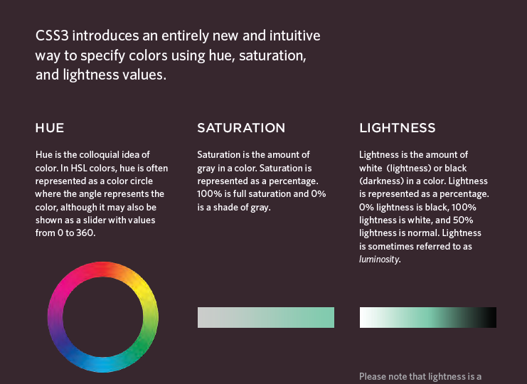
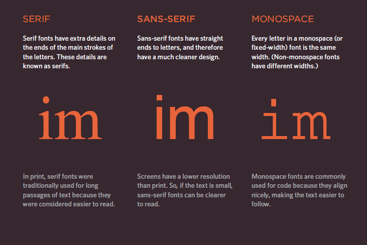

## Image

+ to add image we should add an image we use `` tage with src which helps to locate the image file .

+ alt provides a text discription for the image and Title use to add more infromation .

+ Height & Width of Images helps to  specify the size of the image so that the browser can render the rest of the text on the page while leaving the right amount of space for the image that is still loading.

+ `<figure>` & `<figcaption>` its HTML5 new element so it can come the image assossite with its caption 

## Three Rules for Creating Images :

1 - Save images in the right format

2 - Save images at the right size

3 - Use the correct resolution

## Notes 

1 - Use GIF or PNG format when saving images with few colors or large areas of the same color.

2 - The images you use on your website should be saved at the same width and height that you want them to appear on the age.

## You can specify any color in CSS in one of three ways :

+ rgb values These express colors in terms of how much red, green and blue are used to make it up. 

+ hex codes These are six-digit codes that represent the amount of red, green and blue in a color, preceded by a pound or hash # sign.

+ color names There are 147 predefined color names that are recognized by browsers.

## Note 2

+ opacity property which allows you to specify the opacity of an element The value is a number between
0.0 and 1.0

## Text 

### There are two Types of properites allow us to control of The text apperance 

1 - Those that directly affect t ●● he font and its appearance.

2 - Those that would have the same effect on text no matter what font you were using like colors.

