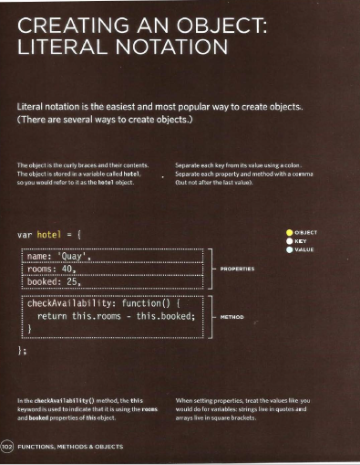
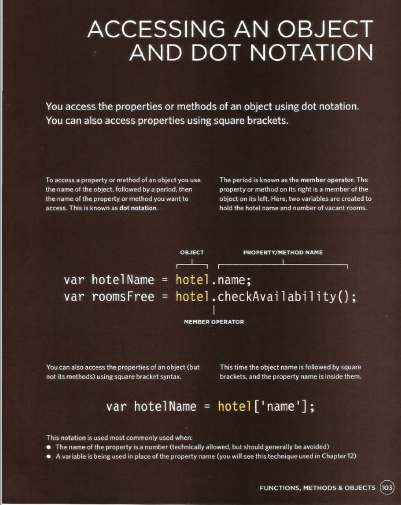
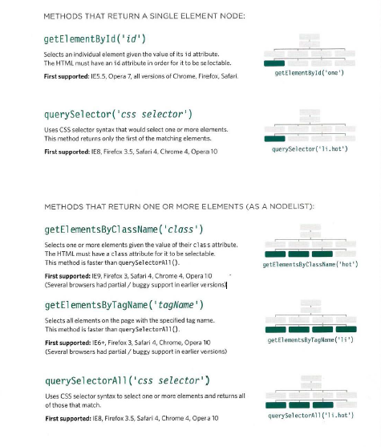
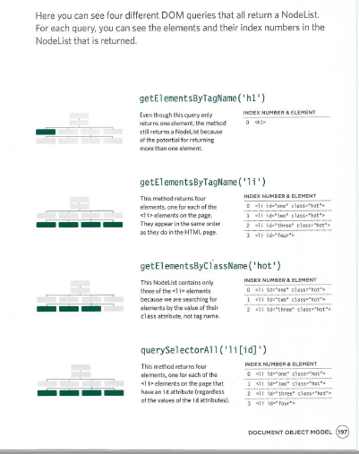

## Objects

Objects group together a set of variables and functions to create a modelof a something you would recognize from the real world.

1 IN AN OBJECT: VARIABLES BECOME KNOWN AS PROPERTIES

Properties te ll us about the object

2 IN AN OBJECT: FUNCTIONS BECOME KNOWN AS METHODS

Methods represent tasks that are associated with the object.

## The DOM 

it is a separate set of rules implemmented by all majer browser markers ,dosent consider as HTML nor Javascript.

* DOM tree: a model of that page stored in the browsers' memoryconsists of four main types of nodes.

1 - THE DOCUMENT NODE

2 - ELEMENT NODES : HTML elements describe the structure of an HTML page.

3 - ATTRIBUTE NODES : The opening tags of HTML elements can carry attributes and these are represented by attribute nodes in the DOM tree.

4 - TEXT NODES

## ACCESSING ELEMENTS

