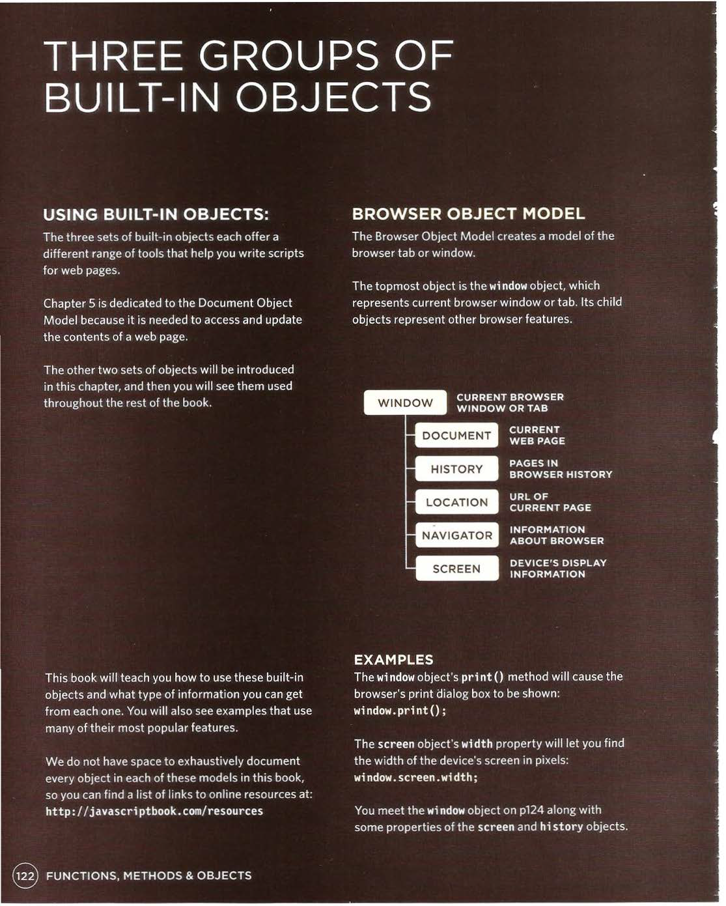
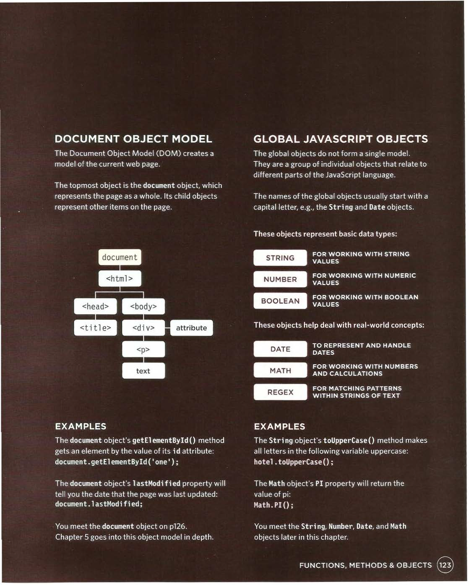

## Tables 

## A table represents information in a grid format.


### Q1 How to create a Table on html ?


1 - You indicate the start of eachrow using the opening <tr> tag.


2- Each cell of a table isrepresented using a <td> element .

```

<table>
<tr>
<td>15</td>
<td>15</td>
<td>30</td>
</tr>
<tr>
<td>45</td>
<td>60</td>
<td>45</td>
</tr>


```

+ The <th> element is used just like the <td> element but its  purpose is to represent the  heading for either a column or a row. (The th stands for table heading.)


+ Spanning ColumnS


### You may  need entries in a table to stretch down across more than one row or cplumns.

1-  colspan attribute is 2, which indicates that the cell should run across two columns.

2- The rowspan attribute can beused on a `<th>`  or  `<td> `element to indicate how many rows a cell should span down the table.


``` 

<td colspan="2">Geography</td>

<td rowspan="2">Movie</td>

```


# BUILT-IN OBJECTS

Browsers come with a set of built-in objects that represent things like the browser window and the current web page shown in that window.





