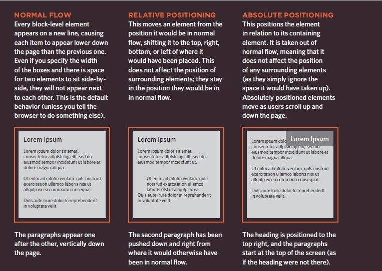
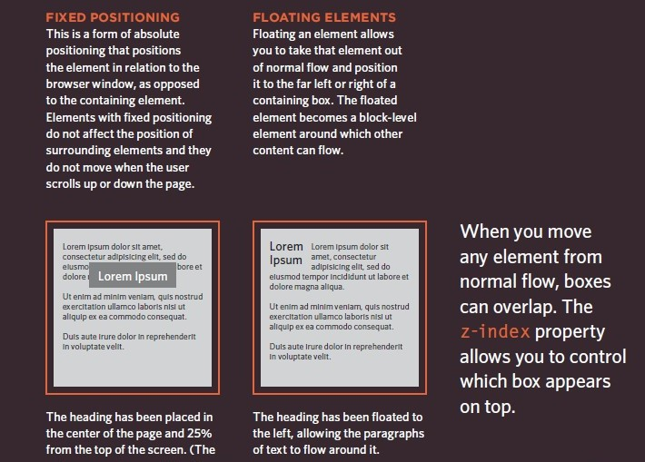

# LAYOUT

## Building Blocks

+ Block-level elements :

Block-level boxes start on a new line and act as the main building blocks
of any layout, while inline boxes flow between surrounding text.


 ```

<h1> <p> <ul> <li>

```

+ Inline elements :

flow in between surrounding text

 ```

 <b> <i>
```
+ Containing Elements 

one block-level element sits inside another  block-level element then the outer box (parent element)


## Controll ing the Position of Elements




