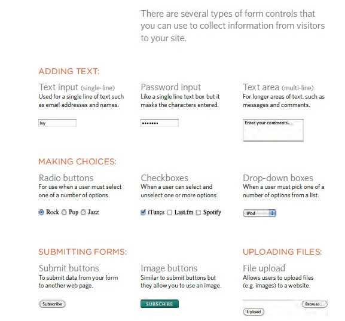

## Form
collect information from visitors to your site and there are several types of form controls .

+ ADDING TEXT:

+ Making Choiceces:

+ Submitting Forms:

## Tables notes

+ There are diffrent type of stayling like list-style-image, list-style-type and list-style-position.
+ Table cells can have different borders and spacing in different browsers, but there are properties you can use to control them and make them more consistent

## Lists:

it allows you to control the shape or style of a bullet point.

There are two types of lists; unordered list/ ordered list.

list-style-image: to add an image to your bullet point.

list-style-position: specifies the position of the list-item markers (bullet points).

## Events in js :

An HTML event can be something the browser does or something a user does.

 onchange : An HTML element has been changed.

 onclick : The user clicks an HTML element.

 onlouseover : The user moves the mouse over an HTML element.

 onmouseout : The user moves the mouse away from an HTML element.

 onkeydown : The user pushes a keyboard key.

 onload : The browser has finished loading the page.