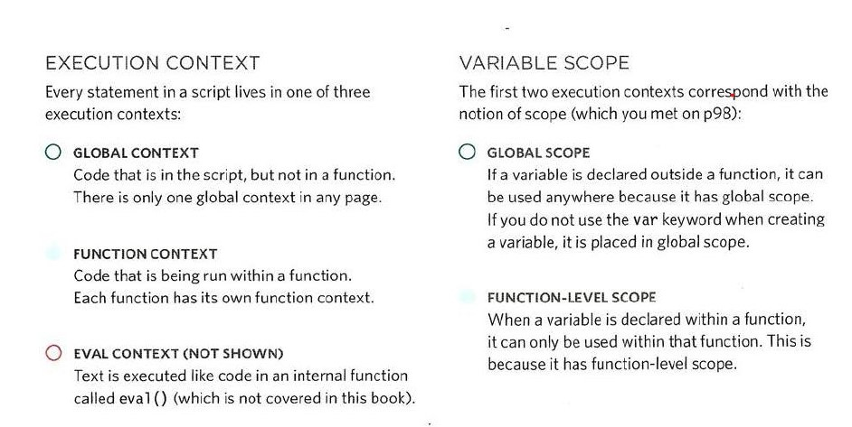

# ERROR HANDLING & DEBUGGING
 
to find erros you need to understand the method of how it works with Js  , to get better understanding you should know ?

## ORDER OF EXECUTION
The order in which statements are executed can be complex; some tasks cannot complete until another statement or function has been run.

## EXECUTION CONTEXTS

## ERROR OBJECTS
Error objects can help you find where your mistakes are and browsers have tools to help you read them.

### The Stack

When The any function run It stop the processer line and piles the new function on the top