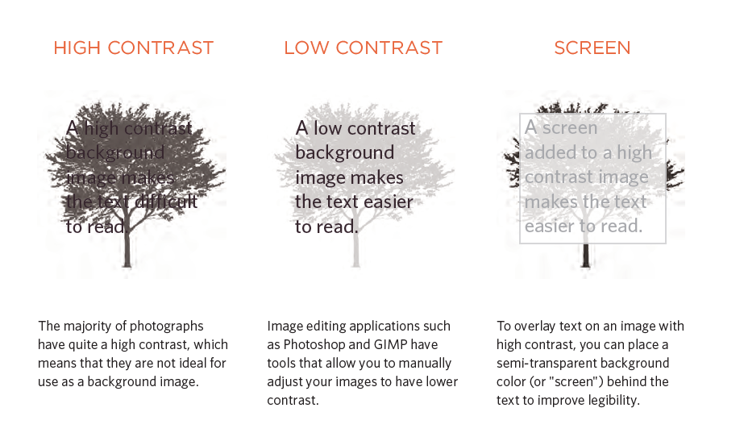

# Images 

## Here are some things we can do by Css for the Images

 * control the size of an image using the width and height properties in CSS
 
 * Alining images the float property can be used to move an element to the left or the right.

 * Background Images The background-image property allows you to place an image behind any HTML element
    Repeating Images

* The background-repeat property can have four values:

  1- repeat The Defult way that is used 

  2- repeat-x The image is repeated horizontally only

  3- repeat-y The image is repeated vertically only

  4- no-repeat The image is only shown once.

* The background-attachment property specifies whether a background image should stay in one position or move as the user scrolls up and down the page

  1- fixed The background image stays in the same position on the page

  2- Scroll The background image moves up and down as the user scrolls up and down the page.

* Background Position : When an image is not being repeated, you can use the background-position property to specify where in the browser window the background image should be placed .
 
 1 - This property usually has a pair of values. The first represents the horizontal position and the second represents the vertical 

 2- You can also use a pair of pixels or percentages:

  1- The top left corner is equal to 0% 0%. 

  2- values of 50% 50%, centers the image horizontally and vertically.

 * In order to center an image :
    
    1- it should be turned into a blocklevel element using the display property with a value of block.

    2- A : On the containing element, you can use the text-align property with a value of center

    2- B : On the image itself, you can use the use the margin property and set the values of the left and right margins to auto.
   
    * You can specify class names that allow any element to be centered, in the same way that you can for the dimensions or alignment of images.
    

    ### The background property acts like a shorthand for all of the other background properties 

    1: background-color
    2: background-image 
    3: background-repeat
    4: background-attachment
    5: background-position

 * rollover : a link or button that changes to a second style when a user moves their mouse over

 * Contrast of background images

 

 # Search Engine Optimization SEO .

 is the practice of trying to help your site appear nearer the top of search engine results when people look for the topics that your website covers.
 SEO is often split into two areas:
1- on-page techniques : are the methods you can use on your web pages to improve their rating in search engines.
2- off-page techniques : Getting other sites to link to you